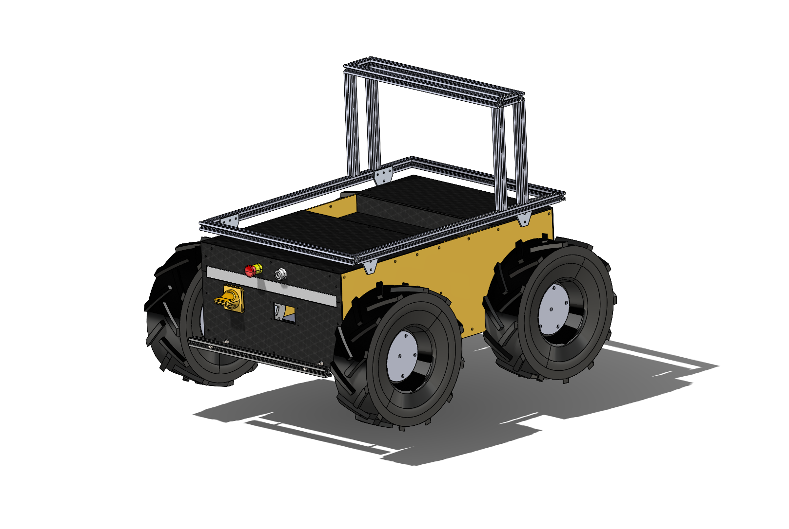
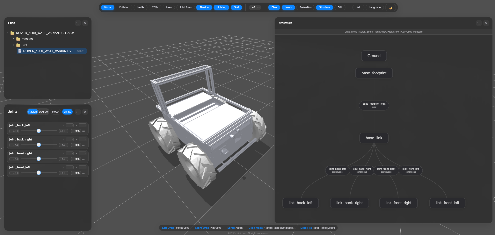

# rover_a1_model

The package contains Solidworks 3D rover model.

## 3D model

## URDF viwer

## License

The Rover A1 design is Apache-2.0 (`LICENSE`). Models of purchased components under
`02_Impl/02_Source/Components/Components_NoProd/` (e.g. the RoboSense RS-LiDAR-16) belong to
their manufacturers and are not covered; see `NOTICE`.
